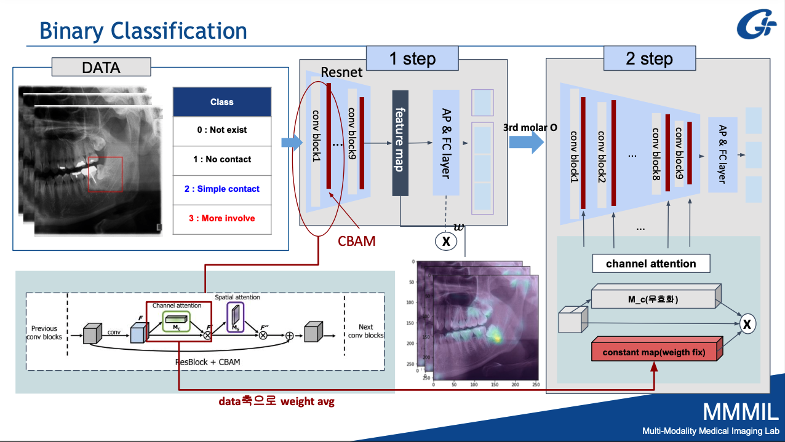
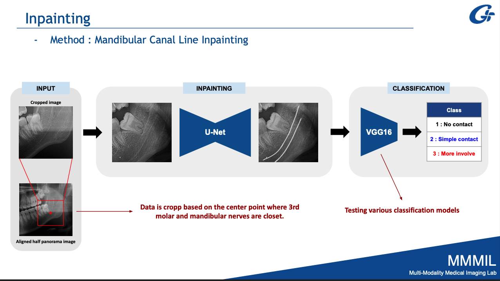
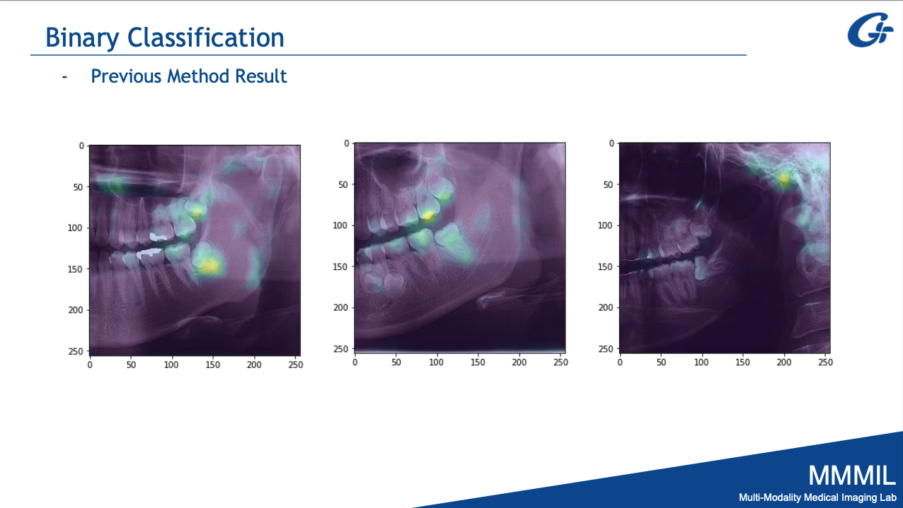

## About The Project

The goal of the project is to determine whether the 3rd Molar and the mandibular canal are in contact with each other in CT images.   
*Data Class*: 0(Not exist), 1(No contact), 2(Simple contact), 3(More involve)

Initially, vanila classification, which receives images as input, achieved an accuracy of less than 50%, and the DL classification learning pipeline was subdivided into three stages to increase accuracy;

*Learning PIPELINE*:
- stage1: the 3rd Molar Binary classification
  - 0 or 1,2,3
  - Check for the 3rd Molar and create an attention feature map to be used as input in stage3.   
- stage2: Canal Line detection & inpainting 
- stage3: Multi-output classification
  - 1 or 2 or 3ß

**[Figure]**
stage1:   
   
stage2:   
 
stage1 output: attention feature map
  

